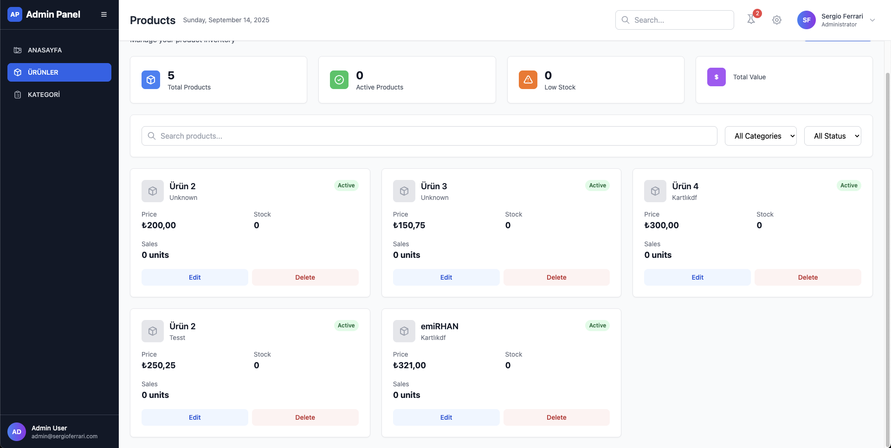
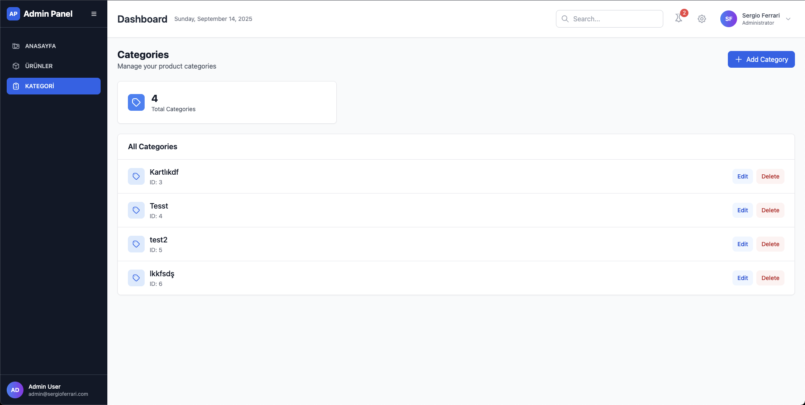
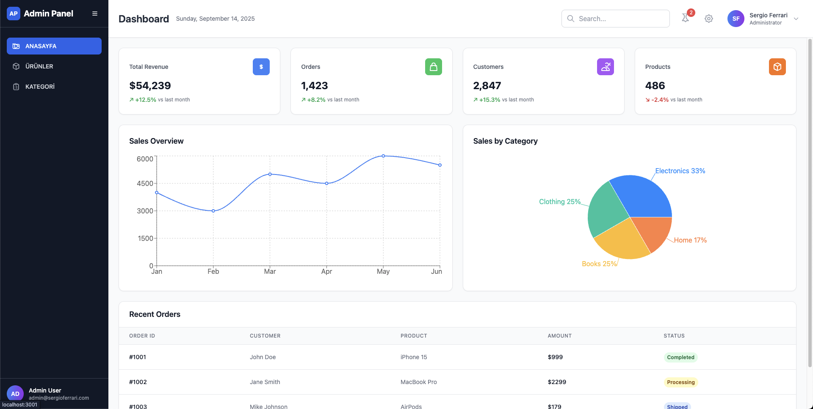

# Sergio Ferrari E-Commerce Admin Panel

Modern ve kullanıcı dostu React tabanlı e-ticaret admin paneli. Ürün ve kategori yönetimi için geliştirilmiş, responsive tasarıma sahip admin dashboard.



## 🚀 Özellikler

### 📊 Dashboard
- Modern ve temiz arayüz
- Responsive tasarım (Mobile, Tablet, Desktop)
- Real-time istatistikler
- Kullanıcı dostu navigasyon

### 📦 Ürün Yönetimi
- Ürün listeleme ve filtreleme
- Yeni ürün ekleme
- Ürün düzenleme ve silme
- Kategori bazlı filtreleme
- Arama fonksiyonu
- Stok takibi
- Durum yönetimi (Aktif/Pasif)



### 🏷️ Kategori Yönetimi
- Kategori listeleme
- Yeni kategori ekleme
- Kategori düzenleme ve silme
- Modal tabanlı form yapısı



## 🛠️ Teknoloji Stack

- **Frontend Framework:** React 19.1.1
- **Styling:** TailwindCSS 3.4.17
- **HTTP Client:** Axios 1.12.1
- **Routing:** React Router DOM 7.9.1
- **Charts:** Recharts 3.2.0
- **UI Components:** Radix UI
- **Table Management:** TanStack React Table
- **Testing:** React Testing Library

## 📁 Proje Yapısı

```
admin-panel/
├── public/
├── src/
│   ├── components/
│   ├── pages/
│   │   ├── Products.js       # Ürün yönetimi sayfası
│   │   └── Categories.js     # Kategori yönetimi sayfası
│   ├── services/
│   │   └── api.js           # API servisleri
│   ├── App.js
│   └── index.js
├── project-images/          # Proje görselleri
├── package.json
└── README.md
```

## 🚦 Kurulum

### Gereksinimler
- Node.js (v14 veya üzeri)
- npm veya yarn
- Backend API servisi

### Adımlar

1. **Projeyi klonlayın**
```bash
git clone <repository-url>
cd admin-panel
```

2. **Bağımlılıkları yükleyin**
```bash
npm install
```

3. **Ortam değişkenlerini ayarlayın**
```bash
# .env dosyasını oluşturun
REACT_APP_BACKEND_URL=http://localhost:3000
```

4. **Uygulamayı başlatın**
```bash
npm start
```

Uygulama [http://localhost:3000](http://localhost:3000) adresinde çalışacaktır.

## 🔧 Kullanılabilir Komutlar

```bash
# Geliştirme sunucusunu başlat
npm start

# Production build oluştur
npm run build

# Testleri çalıştır
npm test

# React Scripts yapılandırmasını çıkar
npm run eject
```

## 🌐 API Endpoints

### Ürün API'leri
```javascript
GET    /products         // Tüm ürünleri listele
GET    /products/:id     // Belirli ürünü getir
POST   /products         // Yeni ürün oluştur
PUT    /products/:id     // Ürünü güncelle
DELETE /products/:id     // Ürünü sil
```

### Kategori API'leri
```javascript
GET    /category         // Tüm kategorileri listele
GET    /category/:id     // Belirli kategoriyi getir
POST   /categories       // Yeni kategori oluştur
PUT    /categories/:id   // Kategoriyi güncelle
DELETE /categories/:id   // Kategoriyi sil
```

## 📝 Özellik Detayları

### Ürün Yönetimi
- **Filtreleme:** Ürün adı, kategori ve durum bazlı filtreleme
- **Modal Form:** Ürün ekleme/düzenleme için kullanıcı dostu modal
- **Validasyon:** Form validasyonu ve hata yönetimi
- **Responsive Grid:** Farklı ekran boyutlarında optimize edilmiş grid yapısı

### Kategori Yönetimi
- **CRUD Operations:** Tam kategori yönetimi (Create, Read, Update, Delete)
- **Instant Updates:** Anlık veri güncellemeleri
- **Confirmation Dialogs:** Silme işlemleri için onay diyalogları

### UI/UX Özellikleri
- **Loading States:** Yükleme animasyonları
- **Error Handling:** Hata durumu yönetimi
- **Empty States:** Boş durumlar için kullanıcı dostu mesajlar
- **Hover Effects:** İnteraktif hover efektleri
- **Status Badges:** Renk kodlu durum etiketleri

## 🎨 Tasarım Sistemi

- **Color Palette:** Modern ve profesyonel renk paleti
- **Typography:** Okunabilir ve hiyerarşik tipografi
- **Spacing:** Tutarlı margin ve padding sistemi
- **Components:** Yeniden kullanılabilir bileşen yapısı
- **Icons:** Heroicons icon seti kullanımı

## 🚀 Deployment

### Production Build
```bash
npm run build
```

Build dosyaları `build/` klasörüne oluşturulacaktır.

### Environment Variables
```bash
REACT_APP_BACKEND_URL=https://your-api-domain.com
```

## 👥 Katkıda Bulunma

1. Fork edin
2. Feature branch oluşturun (`git checkout -b feature/amazing-feature`)
3. Commit edin (`git commit -m 'Add some amazing feature'`)
4. Branch'i push edin (`git push origin feature/amazing-feature`)
5. Pull Request oluşturun

## 📄 Lisans

Bu proje MIT lisansı altında lisanslanmıştır.

## 📞 İletişim

- **Proje:** Sergio Ferrari E-Commerce Admin Panel
- **Teknoloji:** React, TailwindCSS, Node.js

---

⭐ Bu projeyi beğendiyseniz yıldız vermeyi unutmayın!
